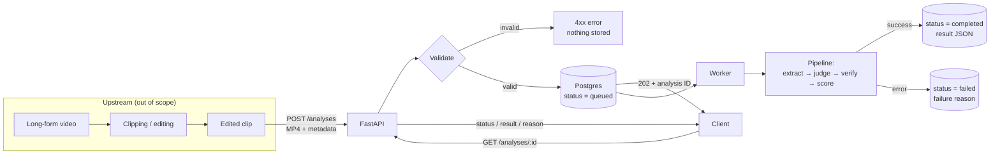

# Clip Scoring Service

**Product Engineering Take-Home, Home Game**

---

## Executive summary

Short-form teams produce more clips than they can publish, and the decision about which clips to post is usually made by eye, one clip at a time. The Clip Scoring Service turns that decision into a consistent, explainable review.

For every clip it receives, the service returns:

- **A verdict:** post, improve, or skip.
- **An overall score** from 0 to 10.
- **Six scores by area**, each supported by evidence from the clip and a concrete fix.
- **A view of the clip's viral potential:** what helps it travel, what holds it back, and its most shareable line.

The service is built around one principle: **measure first, judge second, verify always.** Objective signals such as timing, pauses, cuts and loudness are measured by code. A language model judges only what requires judgment, grounded on those measurements. Code then checks the model's claims against the measurements before any score is reported.

The scope of this version is deliberately focused. It covers the full path from upload to a stored, retrievable result, within the 12-hour effort cap and with a buffer reserved for risk. Every item left out is documented, with its reason, in [section 23](#23-future-improvements).

> **Document status.** This began as the design proposal and is updated as results come in: a real output is in [section 19](#19-example-requests-and-output), verification and repeatability in [section 21](#21-verification), measured cost in [section 22](#22-cost). What was not done, such as the 30-clip dataset run, is marked **Not done**.

---

## Contents

**Part 1: Business scope**

1. [The problem](#1-the-problem)
2. [Who uses it and when](#2-who-uses-it-and-when)
3. [Scope](#3-scope)
4. [Assumptions](#4-assumptions)
5. [The scoring rubric](#5-the-scoring-rubric)
6. [How success is measured](#6-how-success-is-measured)
7. [Known limitations](#7-known-limitations)
8. [Product research and rationale](#8-product-research-and-rationale)

**Part 2: Technical solution**

9. [Architecture](#9-architecture)
10. [Analysis pipeline](#10-analysis-pipeline)
11. [Tools, feasibility and model judgment](#11-tools-feasibility-and-model-judgment)
12. [API](#12-api)
13. [Storage and durability](#13-storage-and-durability)
14. [Repeatability and caching](#14-repeatability-and-caching)
15. [Interrupted runs, duplicates and concurrency](#15-interrupted-runs-duplicates-and-concurrency)
16. [Model strategy](#16-model-strategy)
17. [Stack](#17-stack)
18. [Setup and running](#18-setup-and-running)
19. [Example requests and output](#19-example-requests-and-output)
20. [HTML report](#20-html-report)
21. [Verification](#21-verification)
22. [Cost](#22-cost)
23. [Future improvements](#23-future-improvements)

---

# Part 1: Business scope

## 1. The problem

Teams producing short-form content generate more clips than they can publish. Choosing which ones go out is a manual, inconsistent process: two editors can reach different conclusions about the same clip, and neither conclusion comes with a reason the rest of the team can act on.

The Clip Scoring Service gives every clip the same structured review: what works, what does not, and what to fix. This allows the team to prioritise publishing and to invest editing time where it has the greatest effect.

The service evaluates **craft**: how well a clip is built to hold a viewer. It does not forecast views. Reach depends on factors outside the video itself, such as account size, timing, topic and the platform's distribution, so the score is positioned as a quality signal rather than a performance prediction.

## 2. Who uses it and when

Scoring adds value at two moments in the production workflow:

| Moment                 | Question it answers                                         | Status in this version                               |
| ---------------------- | ----------------------------------------------------------- | ---------------------------------------------------- |
| **(a) Before editing** | Which raw cuts are worth editing?                           | Not included; the design allows it to be added later |
| **(b) After editing**  | Is this clip ready to post, or should it be improved first? | **Primary focus**                                    |

The sample dataset consists of clips already published on TikTok, which corresponds to moment (b).

Clips are **uploaded and analysed individually**. Each result stands on its own and is never ranked against other clips.

Each analysis delivers:

- **Verdict:** `post`, `improve` or `skip`.
- **Overall score** from 0 to 10.
- **A score for each of six areas**, with supporting evidence (timestamps and measured values) and a recommended fix.
- **A confidence level** for each area, indicating which scores rest on measurement and which rest on judgment.
- **Viral potential:** the strengths likely to help the clip travel, the weaknesses likely to hold it back, and its most shareable line. These are signals associated with watching and sharing, read from the clip itself, and are not a view forecast.

## 3. Scope

**Included**

- Upload of an MP4 with basic metadata, returning an analysis ID.
- Retrieval of the result, current status or failure reason by ID.
- Six scoring areas, an overall score and a verdict.
- Results that remain available after an unexpected crash and restart.
- Clear, documented error responses.
- A repeatability check and a full run over the 30-clip sample dataset.

**Excluded, and documented**

- Selecting clips from long-form video, which happens upstream of this service.
- Pre-production strategy or trend advice.
- Ranking clips against each other. The team confirmed that clips are independent.
- Automatic retries and recovery after a crash. Interrupted analyses are marked as failed with a clear reason; the behaviour and next steps are described in [section 15](#15-interrupted-runs-duplicates-and-concurrency).
- Platform-specific scoring. One general approach covers TikTok and Instagram.
- Languages other than English.

## 4. Assumptions

**Confirmed with the team**

1. **English only.** Spanish is a natural next step.
2. **Clips arrive already edited**, although some may look unedited (no captions, no headline). Missing captions carry a light penalty and appear as a recommendation rather than a heavy deduction.
3. **Clips are independent.** There is no grouping or ranking across clips.

**Working assumptions**

4. **Craft only, stance-neutral.** The sample clips cover political and policy topics. The service evaluates how a clip is built, never the opinion it expresses, and the model is explicitly instructed to disregard political position.
5. **Out-of-context clips** are addressed by the _standalone completeness_ area, which asks whether the clip makes sense without the full episode.
6. **General audience.** This version does not tune scoring by niche or client.

## 5. The scoring rubric

### Purpose

A rubric is an agreed definition of what makes a clip good. It makes every review **consistent** (the same criteria every time), **explainable** (every score has a reason) and **actionable** (a low score points to a specific fix).

### The six areas

The areas follow the viewer's experience of a clip in order: stopping to watch, understanding the message, staying until the end, and being able to hear and read it.

| #   | Area                           | Question it answers                                                           | Weight |
| --- | ------------------------------ | ----------------------------------------------------------------------------- | ------ |
| 1   | **Hook**                       | Do the first three seconds give the viewer a reason to keep watching?         | 25%    |
| 2   | **Standalone completeness**    | Does the clip start and end cleanly, and make sense without the full episode? | 20%    |
| 3   | **Message clarity and payoff** | Is there one clear point, and does it land by the end?                        | 20%    |
| 4   | **Pacing and energy**          | Is the clip free of dead air and flat stretches?                              | 15%    |
| 5   | **Audio and speech quality**   | Can the speaker be heard clearly and comfortably?                             | 10%    |
| 6   | **On-screen text**             | Do captions or a headline support viewers watching without sound?             | 10%    |

The weights are an initial proposal and are calibrated on a small development subset of the dataset (see [section 6](#6-how-success-is-measured)).

### Scale and calculation

- Each area is scored from **0 to 10**: 0 means it fails completely, 5 is acceptable, 10 is excellent.
- The **overall score** is the weighted average of the areas that apply to the clip.
- **Cap rule:** a clip that starts or ends mid-sentence is capped at **6.0**. It cannot be recommended for posting as it stands, regardless of its other strengths.
- **Areas that do not apply** to a clip are excluded, and the remaining weights are rescaled to total 100%.

### Verdict

| Overall score | Verdict   | Meaning                                                 |
| ------------- | --------- | ------------------------------------------------------- |
| 7.0 to 10     | `post`    | Ready to publish                                        |
| 5.0 to 6.9    | `improve` | Worth publishing once the recommended fixes are applied |
| 0 to 4.9      | `skip`    | Not worth the editing time                              |

The thresholds are provisional and are calibrated on the dataset.

### Alternatives considered

| Alternative                                   | Reason it was not selected                                                         |
| --------------------------------------------- | ---------------------------------------------------------------------------------- |
| A single overall score from the model         | Opaque, less consistent, and does not meet the requirement of 3 to 10 scored areas |
| Weights learned from performance data         | The right long-term approach, but 30 clips are far too few; planned as future work |
| Three broad areas (hook, content, production) | Too broad to tell an editor what to fix                                            |
| Ten or more detailed checks                   | Overlapping criteria, noisier scores, harder for a stakeholder to read             |
| Grouping by signal type (visual, audio, text) | Natural for engineers, but does not reflect viewer behaviour                       |

## 6. How success is measured

The dataset includes views, likes and shares, but no watch time or retention data, and reach depends on much more than the video itself. Validation therefore focuses on **consistency and sensibility**, not on proving predictive accuracy.

1. **Calibration on a development subset** of a few clips per account, followed by a single run over all 30 clips with the rubric frozen.
2. **Comparison within each account, never across accounts.** Views are normalised by each account's median, because a weak clip on a large account can outperform a strong clip on a small one.
3. **Directional check:** do higher-scoring clips tend to perform above their account's median? With ten clips per account, this is a signal rather than proof.
4. **Manual review** of the evidence and fixes for a small set of clips, to confirm that an editor would agree.
5. **Repeatability:** two clips analysed five times each from scratch, measuring score variation and whether the verdict ever changes.
6. **Fairness across production styles:** confirmation that interview, studio opinion and podcast formats are not systematically favoured or penalised.

Performance data is **never** provided to the analysis. It is used only afterwards, for evaluation.

Results: item 5 is done. Five fresh runs each of two clips never changed the verdict or the overall score ([repeatability results](#repeatability-results)). Items 1 to 4 and 6 need the 30-clip dataset run, which was not done in this version, so usefulness against real performance is still untested ([section 21](#21-verification)).

## 7. Known limitations

- **Small sample.** Thirty clips, ten per account. Any correlation is directional only.
- **No retention data.** The link between a strong hook and viewers staying is an industry assumption that this dataset cannot confirm.
- **Speech-led clips only in this version.** Nearly every sample clip features someone speaking, so the service assumes speech. Clips with little speech, such as music or slideshows, are flagged with low confidence rather than scored on a dedicated path.
- **One general audience.** No tuning by niche, client or platform.
- **English only.**
- **Judgment-based areas carry more uncertainty.** Message clarity and on-screen text rely mainly on model judgment and are less certain than measured areas such as loudness and pauses. Confidence levels make this visible to the reader.

## 8. Product research and rationale

### Research approach

- **Reference products.** The five products listed in the brief were reviewed, including ClipAPI's public API reference, together with clip engines such as WayinVideo and Vizard. The review focused on what each product measures, how it explains its scores and how it is built.
- **The team.** Three scoping questions were raised in Slack; the answers are reflected in [section 4](#4-assumptions).
- **The dataset.** The 30 sample clips and their metadata were reviewed for what they can and cannot demonstrate.
- **Model-based judgment.** Current guidance on using language models as evaluators informed the judgment design ([section 11](#11-tools-feasibility-and-model-judgment)).
- **External comparison (deferred).** A comparison with ClipAPI and Retensis scores is documented as a next step ([section 23](#23-future-improvements)).

### Reference products

| Product      | What it does                                                                                                                                                                                           | What this service adopts                                                                        | What it leaves out, and why                                                                                                           |
| ------------ | ------------------------------------------------------------------------------------------------------------------------------------------------------------------------------------------------------ | ----------------------------------------------------------------------------------------------- | ------------------------------------------------------------------------------------------------------------------------------------- |
| **Retensis** | Scores hook, pacing, audio, visual and engagement from 0 to 100, prioritises improvements, predicts a retention curve with timestamped drop-off reasons, and compares against a creator's past uploads | A score per area with a fix, timestamped evidence, and a report a non-technical reader can scan | The predicted retention curve, which cannot be validated without retention data. History comparison, since clips here are independent |
| **Pacing**   | Extracts frames, separates audio, reads cuts on a precise timeline, and cross-checks each model recommendation against measured audio and frames                                                       | The core architecture: **measure, judge, verify**                                               | Audio stem separation, which exceeds the time budget                                                                                  |

### Approaches in the market

| Approach                                | How it works                                                                                                              | Assessment                                                                                                   |
| --------------------------------------- | ------------------------------------------------------------------------------------------------------------------------- | ------------------------------------------------------------------------------------------------------------ |
| The model watches the video             | A video-language model is asked for scores directly                                                                       | Simplest, but the result is the model's opinion: hard to verify and close to forwarding a finished score     |
| **Measure, judge, verify** _(selected)_ | Code measures; a model judges only what requires judgment, grounded on the measurements; code verifies the model's claims | Explainable, more economical, more repeatable, and the point where this service contributes its own analysis |
| Transcript-first ranking                | Candidate moments are ranked from a transcript                                                                            | Designed for selecting clips from long-form video, upstream of this problem                                  |

### Key decisions

| Decision                            | Options considered                                             | Selected                              | Rationale                                                                                                                    |
| ----------------------------------- | -------------------------------------------------------------- | ------------------------------------- | ---------------------------------------------------------------------------------------------------------------------------- |
| When scoring happens                | Before editing (a) or after editing (b)                        | **After editing**                     | The dataset consists of published clips, and the team accepted either option                                                 |
| What the user receives              | Scores only, or scores with a verdict and fixes                | **Verdict, scores and fixes**         | A decision and a next action are more useful than a number                                                                   |
| Rubric size                         | 3, 6 or 10+ areas                                              | **6**                                 | Detailed enough to point to a fix, short enough to read in a minute                                                          |
| Who calculates the overall score    | The model or code                                              | **Code**                              | Identical inputs always produce identical arithmetic; the model cannot shift the verdict                                     |
| How the model judges                | One call, one specialist per area, or a panel                  | **One call now, specialists next**    | One structured call is the fastest to build and debug; specialist judges are the first planned upgrade                       |
| Grouping clips                      | Build or omit                                                  | **Omitted**                           | The team confirmed clips are independent                                                                                     |
| Processing                          | Synchronous or in the background                               | **Background**                        | An analysis takes tens of seconds; both options are acceptable                                                               |
| Report                              | Single-page application or server-rendered HTML                | **Server-rendered HTML**              | No build step; fits the time budget ([section 20](#20-html-report))                                                          |
| Retention curve and view prediction | Predict or omit                                                | **Omitted**                           | No data to validate them; the report presents verifiable evidence instead                                                    |
| Call-to-action area                 | Include or omit                                                | **Omitted**                           | Rarely present in interview and podcast clips; it would penalise the format rather than the craft                            |
| Scope within the 12-hour cap        | Build everything, or build the core well and document the rest | **Core service plus a simple report** | Optional work does not compensate for an incomplete core. Deferred items are listed in [section 23](#23-future-improvements) |

### Assumptions and findings

This table separates what is assumed from what is tested, and is updated as results become available.

| Statement                                          | Status                          | How it is checked                                                                |
| -------------------------------------------------- | ------------------------------- | -------------------------------------------------------------------------------- |
| A strong hook keeps viewers watching               | Assumption (industry consensus) | Requires retention data, which the dataset does not include                      |
| Clips that start or end mid-sentence perform worse | Assumption                      | Directional check: capped versus uncapped clips against account-normalised views |
| Scores are stable across fresh runs                | Tested on 2 clips × 5 runs: verdict and overall score unchanged; one judged run moved two areas by one step | Repeatability experiment ([section 21](#repeatability-results))                  |
| The rubric does not favour one production style    | To be tested                    | Score distribution per account                                                   |
| The measured signals are accurate on these clips   | To be tested                    | Manual review of five clips                                                      |
| Cost remains under $1 per clip                     | Measured: $0.0070 on average over 19 runs | Gateway-billed cost per analysis, recomputed once from tokens ([section 22](#22-cost)) |

### Success criteria for this version

- A reviewer can set up the service from this document alone and analyse their own clip.
- Every score is supported by evidence that can be checked against the video.
- The verdict for a given clip remains the same across fresh runs.
- Cost remains well under $1 per clip.

---

# Part 2: Technical solution

## 9. Architecture



**Core guarantee:** every state change is committed to the database before it is reported. A client never receives an ID that does not exist in the database.

## 10. Analysis pipeline

The pipeline follows the **measure, judge, verify** pattern. Deterministic tools measure everything that can be measured; a model judges only what requires judgment, grounded on those measurements; code then verifies the model's claims. This is where the service adds its own analysis, rather than forwarding a provider's opinion of the video.

### Stage 1: Validation

The file must be a readable MP4 with a video stream, within the duration limit (default 240 seconds, configurable). Metadata must be well-formed.

### Stage 2: Speech check

The service assumes a speech-led clip, consistent with the dataset. When the measured speech ratio falls below approximately 30%, the clip is marked `low_speech` and the speech-based areas receive low confidence. A full speech, music and noise classifier is deferred ([section 23](#23-future-improvements)).

### Stage 3: Signal extraction (deterministic)

| Signal                                                           | Tool                                                         | Used by                     |
| ---------------------------------------------------------------- | ------------------------------------------------------------ | --------------------------- |
| Transcript with word timestamps                                  | faster-whisper (local)                                       | Hook, completeness, clarity |
| Time to first word, first sentence                               | Transcript                                                   | Hook                        |
| Clip starts or ends mid-sentence                                 | Speech active at the first or last frame, plus opening words | Completeness, cap rule      |
| Speech ratio, pauses over 1 second, words per minute             | Voice activity detection and transcript                      | Pacing                      |
| Scene cuts per minute                                            | PySceneDetect (AdaptiveDetector)                             | Pacing, hook                |
| Loudness (LUFS), clipping, silence                               | ffmpeg `ebur128` and `silencedetect`                         | Audio                       |
| Sampled frames (dense in the first 3 seconds, sparse afterwards) | ffmpeg                                                       | Hook, on-screen text        |

### Stage 4: Judgment (single model call)

One call to the pinned model scores the four judgment-based areas: hook, completeness, clarity and on-screen text. The call receives the timestamped transcript, the measured signals, up to 16 sampled frames (`LLM_MAX_FRAMES`: three in the first 3 seconds, the rest spread over the clip), and the anchored rubric for each area. It returns **structured JSON only**: for each area, a score, timestamped evidence, one recommended fix and a confidence level, together with the summary, the clip's main point and the viral potential fields. Pacing and audio are scored from measurements. The model never calculates the overall score or the verdict. The design rationale is described in [section 11](#11-tools-feasibility-and-model-judgment).

### Stage 5: Verification

Three deterministic rules check the model against the measurements:

- **Late start:** if the first word arrives after 4 seconds, the hook score is capped regardless of the model's assessment.
- **Boundary cut:** if speech is active at the first or last frame and the clip opens with a conjunction, completeness is flagged and the cap rule applies.
- **Unsupported evidence:** if a score cites a timestamp beyond the clip's length, its confidence is lowered.

Further rules can be added without changing the pipeline.

### Stage 6: Scoring

The overall score, cap rule and verdict are calculated **in code** from the rubric configuration. Identical inputs always produce identical results.

## 11. Tools, feasibility and model judgment

Every area of the rubric can be delivered with standard, mostly local tools, within the $1-per-clip target and the 12-hour cap. The areas differ in reliability: some rest on hard measurements, while in this version two (message clarity and on-screen text) rely almost entirely on model judgment. This section makes that difference explicit.

### Toolbox

| Tool                                 | Purpose                                                            | Reason for selection                                                                                                            | Alternative considered                                                                                 |
| ------------------------------------ | ------------------------------------------------------------------ | ------------------------------------------------------------------------------------------------------------------------------- | ------------------------------------------------------------------------------------------------------ |
| **ffmpeg**                           | Decoding, frame sampling, loudness, silence detection              | Standard and deterministic                                                                                                      | –                                                                                                      |
| **faster-whisper**                   | Transcript with word timestamps; built-in voice activity detection | Runs locally on CPU at no cost, fast enough for 1 to 3 minute clips                                                             | **WhisperX**, for more precise word timestamps if boundary detection proves unreliable                 |
| **PySceneDetect** (AdaptiveDetector) | Cut detection and visual change in the first 3 seconds             | Handles camera movement better than a fixed threshold                                                                           | ffmpeg scene filter (fewer dependencies, less precise)                                                 |
| **Gateway model** (pinned)           | The judgment call, including up to 16 frames                       | Requires image support; selected in the model selection phase ([section 16](#16-model-strategy))                                | Sending the full video to a video-native model: simpler, but closer to forwarding and harder to verify |
| **Ollama with local Gemma**          | Development runs                                                   | No cost; same client interface as the gateway; the 4B and larger Gemma 3 models accept images, so frame checks also run locally | Llama 3.1 (text only)                                                                                  |

### Reliability by area

| Area                           | Measured by code                                                  | Judged by the model                                                                          | Measured / judged | Confidence     | Main risk                                                                                                                                              |
| ------------------------------ | ----------------------------------------------------------------- | -------------------------------------------------------------------------------------------- | ----------------- | -------------- | ------------------------------------------------------------------------------------------------------------------------------------------------------ |
| **Hook**                       | Time to first word, cuts and visual change in the first 3 seconds | Whether the opening line or image creates a question, claim or tension                       | ~40 / 60          | Medium         | "A reason to keep watching" is subjective; the hook-retention link is an assumption                                                                    |
| **Standalone completeness**    | Speech active at the first or last frame; opening conjunctions    | Unexplained references; whether the clip ends on a complete thought                          | ~50 / 50          | Medium to high | Transcription tidies punctuation, so punctuation is not used on its own. The cap rule requires **two agreeing signals** to avoid penalising good clips |
| **Message clarity and payoff** | –                                                                 | Whether the point fits in one sentence and whether the ending resolves it                    | ~0 / 100          | Low to medium  | Highest run-to-run variation; exposure to stance bias on political content                                                                             |
| **Pacing and energy**          | Words per minute, pauses, speech ratio, cuts per minute           | Optional context only, such as a deliberate dramatic pause                                   | ~90 / 10          | High           | Thresholds are norms. Cuts carry little weight so static podcast cameras are not penalised                                                             |
| **Audio and speech quality**   | Loudness, clipping, silence, transcription confidence             | –                                                                                            | ~100 / 0          | High           | Music masking speech is measured only approximately                                                                                                    |
| **On-screen text**             | – (OCR deferred)                                                  | Captions and headline read from sampled frames: presence, start time, readability, placement | ~0 / 100          | Medium         | Frames are samples, so short caption gaps may be missed; OCR would make presence measurable                                                            |

Measurements also **bound** the model's judgments. For example, if the first word arrives after 4 seconds, the hook score cannot exceed a configured ceiling, whatever the model concludes. This is the verification stage (Stage 5).

### Judgment design: one call now, specialist judges next

| Option                                                   | How it works                                              | Strengths                                                                            | Weaknesses                                                                             |
| -------------------------------------------------------- | --------------------------------------------------------- | ------------------------------------------------------------------------------------ | -------------------------------------------------------------------------------------- |
| **One call for all areas** _(selected for this version)_ | All evidence and the full rubric in one prompt            | Most economical, simplest to build and debug                                         | The impression of one area can influence the others; a long prompt dilutes each rubric |
| Specialist judge per area _(next step)_                  | One focused call per judgment-based area, run in parallel | Less influence between areas; short, anchored prompts; failures isolated to one area | More calls to coordinate                                                               |
| Panel of judges                                          | Several models or repeated runs, averaged                 | Most stable scores                                                                   | Multiplies cost; reserved for evaluation                                               |

The single call is structured to limit cross-influence: each area has its own section and anchored scale, and the model must state evidence before each score. If the repeatability experiment shows scores moving together, the call is split into specialist judges, which would receive the following evidence:

| Specialist judge   | Evidence                                                                                                                  |
| ------------------ | ------------------------------------------------------------------------------------------------------------------------- |
| Hook               | First ~5 seconds of transcript, time to first word, 3 to 4 frames from the first 3 seconds, cut timestamps in that window |
| Completeness       | First and last two sentences with timestamps, boundary signals, full transcript for reference checks                      |
| Clarity and payoff | Full transcript                                                                                                           |
| On-screen text     | Up to 16 sampled frames, plus OCR output once added                                                                       |

Splitting costs approximately the same in tokens, since each judge receives only part of the evidence.

**Prompt principles, drawn from current practice in model-based evaluation**

- **Anchored scale.** The model scores on a **0 to 5 scale** with a written description of every level; code converts it to 0 to 10. Research on grading scales found the highest agreement between humans and models on 0 to 5, and coarse anchored scales reduce ambiguity.
- **Evidence before score.** The model must cite timestamps or quotes before assigning each score.
- **Calibration examples.** A weak, a middle and a strong clip from the development subset calibrate the prompt.
- **Length limits on explanations.** Models tend to reward length; short, capped explanations prevent this.
- **Stance neutrality.** Every prompt instructs the model to evaluate how the clip is built, never the opinion expressed.
- **Stability controls.** Temperature 0, a pinned model and versioned prompts. The rubric is treated as a hypothesis: versioned like code and recalibrated after changes.

Verification remains **deterministic code**, not another model: it is free, repeatable and cannot hallucinate.

### Included in this version and deferred

| Included                                                                                         | Deferred ([section 23](#23-future-improvements))                                          |
| ------------------------------------------------------------------------------------------------ | ----------------------------------------------------------------------------------------- |
| Transcript and timestamps, boundary checks, pacing from word timestamps, cut detection, loudness | OCR and caption sync, pitch-based energy, speech and music classifier, WhisperX alignment |
| One judgment call with frames, three verification rules, scoring in code                         | Specialist judges, an extended verification rule set                                      |

### Sources

- faster-whisper: https://github.com/SYSTRAN/faster-whisper
- WhisperX: https://github.com/m-bain/whisperX
- PySceneDetect: https://github.com/Breakthrough/PySceneDetect
- inaSpeechSegmenter: https://github.com/ina-foss/inaSpeechSegmenter
- RapidOCR: https://github.com/RapidAI/RapidOCR
- Grading scale impact on model-based evaluation: https://arxiv.org/abs/2601.03444
- Autorubric, rubric-based model evaluation: https://arxiv.org/abs/2603.00077
- Evaluation prompt patterns: https://galtea.ai/blog/llm-as-a-judge-prompts-templates-rubrics-and-best-practices

## 12. API

### `POST /analyses`

Multipart form:

- `file`: the MP4.
- `metadata`: a JSON string, for example `{"title": "...", "account": "...", "platform": "tiktok", "external_id": "C07"}`. **Every field is optional**, and so is `metadata` itself. `platform` must be `tiktok` or `instagram` when present; any other value, a non-string field or invalid JSON returns `400 invalid_metadata`. Only `title` and `platform` go into duplicate detection; `account` and `external_id` are stored and returned.
- `model` (optional): another model from `LLM_MODEL_CHOICES`, for comparing models. Off when that setting is empty; anything not allowed returns `400 model_not_allowed`.
  - `external_id` is the caller's own reference, such as a sample or post ID. It is returned unchanged in every response so results can be matched to the caller's records. It does not affect the analysis and is not part of duplicate detection.

Query parameter:

- `fresh=true` forces a new analysis even when an identical one exists (see [section 14](#14-repeatability-and-caching)).

Responses:

- `202 Accepted` with `{"id": "...", "status": "queued"}` for a new analysis.
- `200 OK` with the existing analysis and `"deduplicated": true` when the same clip is already queued, processing or completed (see [section 15](#15-interrupted-runs-duplicates-and-concurrency)).

### `GET /analyses/{id}`

Returns the analysis and its current status:

| Status       | Meaning                                                                                 |
| ------------ | --------------------------------------------------------------------------------------- |
| `queued`     | Stored and awaiting processing                                                          |
| `processing` | In progress; `current_step` indicates the stage (`extract`, `judge`, `verify`, `score`) |
| `completed`  | Result available                                                                        |
| `failed`     | Includes `error.code` and `error.message`                                               |

### `GET /analyses/{id}/report` _(optional)_

A readable HTML view of a single stored result. See [section 20](#20-html-report).

### `GET /health`

Availability check.

### Processing model

**Asynchronous.** An analysis takes tens of seconds, too long to hold an HTTP request open reliably. `POST` returns an ID immediately and the client polls `GET`. In this version the worker runs in the same process; in production it would run separately (see [section 23](#23-future-improvements)).

### HTTP status codes

| Code  | Condition                                                                                         |
| ----- | ------------------------------------------------------------------------------------------------- |
| `200` | `GET` found the analysis, including failed analyses (the request succeeded; the analysis did not) |
| `200` | `POST` matched an existing analysis of the same clip and returned it                              |
| `202` | `POST` accepted and stored a new analysis                                                         |
| `400` | Malformed metadata (`invalid_metadata`), no file (`missing_file`), a model that is not allowed (`model_not_allowed`), any other invalid field (`invalid_request`) |
| `401` | Basic auth is on (`BASIC_AUTH_USER` / `BASIC_AUTH_PASSWORD`) and the credentials are missing or wrong; every route but `/health` |
| `404` | Unknown analysis ID (`not_found`)                                                                 |
| `413` | File larger than `MAX_UPLOAD_MB`, 200 MB by default (`file_too_large`)                            |
| `415` | Not an MP4 (`unsupported_media_type`)                                                             |
| `422` | MP4 that cannot be processed: corrupt (`unreadable_video`), no video stream (`no_video_stream`), longer than `MAX_DURATION_S`, 240 s by default (`too_long`) |
| `500` | Unexpected server error (`internal_error`)                                                        |

Every error body is `{"error": {"code": "...", "message": "..."}}`. A failed analysis returns `200` with `status: "failed"` and one of these codes in `error.code`: `extraction_failed` (ffmpeg, transcription or scene detection failed), `model_error` (the model call failed), `model_invalid_output` (the model's answer did not match the schema), `interrupted_by_restart` (the service stopped during the run) and `internal_error` (anything else).

## 13. Storage and durability

**Postgres**, run as a container in docker compose with its data on a persistent volume. Selected for three reasons: its write-ahead log makes every committed write survive a crash; it supports the partial unique index and `ON CONFLICT` insert used for duplicate detection ([section 15](#15-interrupted-runs-duplicates-and-concurrency)); and it is the production choice, so no migration is needed later. Docker compose starts it automatically, so reviewers need no manual database setup.

### `analyses` table

| Column                                                             | Purpose                                                                                                                                                                                                      |
| ------------------------------------------------------------------ | ------------------------------------------------------------------------------------------------------------------------------------------------------------------------------------------------------------ |
| `id`                                                               | Analysis ID                                                                                                                                                                                                  |
| `status`                                                           | `queued`, `processing`, `completed` or `failed`                                                                                                                                                              |
| `current_step`                                                     | Pipeline stage during processing                                                                                                                                                                             |
| `external_id`                                                      | Caller's reference, returned unchanged                                                                                                                                                                       |
| `file_sha256`                                                      | Content hash of the video                                                                                                                                                                                    |
| `cache_key`                                                        | Hash of the file, the analysis-relevant metadata and the configuration versions. Unique while the row is queued, processing or completed (see [section 15](#15-interrupted-runs-duplicates-and-concurrency)) |
| `metadata_json`                                                    | Metadata supplied by the client (`JSONB`)                                                                                                                                                                    |
| `result_json`                                                      | Full result once completed (`JSONB`)                                                                                                                                                                         |
| `error_code`, `error_message`                                      | Failure reason                                                                                                                                                                                               |
| `model_id`, `prompt_version`, `rubric_version`, `pipeline_version` | What produced the result                                                                                                                                                                                     |
| `cost_usd`, `duration_ms`                                          | Measured for each analysis                                                                                                                                                                                   |
| `created_at`, `started_at`, `finished_at`                          | Timestamps                                                                                                                                                                                                   |

Uploaded files are stored on a mounted volume under their SHA-256 hash; the database holds only their metadata and results.

### Surviving an unexpected crash

- Every write is committed before anything is returned to the client.
- On startup, any analysis left queued or processing is marked failed with the reason `interrupted_by_restart`. Resuming interrupted work is out of scope; [section 15](#15-interrupted-runs-duplicates-and-concurrency) describes the behaviour and next steps.
- A script reproduces the check: upload, forcibly stop the server, restart it, and retrieve the ID (see [section 21](#21-verification)).

## 14. Repeatability and caching

Two distinct cases are handled separately:

- **Cached retrieval.** The same video with the same metadata and configuration returns the stored result immediately, marked `"source": "cached"`. This avoids cost and returns an identical answer by definition.
- **Fresh analysis.** `fresh=true` runs the full pipeline again, marked `"source": "fresh"`. The repeatability experiment uses this mode, so it measures the model's real stability rather than the cache.

Fresh analyses are stabilised through temperature 0, a fixed seed where the provider supports it, a pinned model version, and scores calculated in code rather than by the model. Every result records the model, prompt, rubric and pipeline versions that produced it.

## 15. Interrupted runs, duplicates and concurrency

Job recovery and retries are outside the scope of this exercise, and documenting duplicate and concurrency handling is sufficient. This section describes the current behaviour and the planned next steps. The guiding principle: **a client submitting the same clip never pays for the same analysis twice.**

### When the service stops during an analysis

**Current behaviour**

- Every status change is committed before it is reported, so the database is always the source of truth.
- The worker queue is held in memory and is lost on a crash. On startup, every analysis left queued or processing is marked failed with `interrupted_by_restart`. No analysis remains stuck, and the caller receives a clear reason.
- The caller can resubmit the clip. Failed analyses are excluded from duplicate detection, so a resubmission starts a new analysis.
- Completed analyses are never affected.

**Next steps**

1. **Stage checkpoints.** The outputs of expensive stages are stored, keyed by file hash and pipeline version, so a rerun resumes from the failed step.
2. **Leases instead of a startup sweep.** A worker claims a job for a limited time and renews the claim while working. If the worker stops, the job returns to the queue automatically. Postgres supports this directly with `SELECT ... FOR UPDATE SKIP LOCKED`, which also makes multiple workers safe.
3. **Bounded retries for transient errors only.** Timeouts, rate limits and provider errors are retried at most twice with exponential backoff. Unreadable files are never retried; invalid model output is retried at most once. Every attempt and its cost are recorded, and a per-clip cost ceiling stops runaway spending.
4. **Orchestration in production.** Each pipeline stage becomes a task in an external orchestration tool, which provides leases, retries, backoff and resumption without custom code.

### Duplicate and concurrent requests

**How a duplicate is identified**

The `cache_key` combines the file's content hash, the metadata fields that influence the analysis, and the model, prompt, rubric and pipeline versions. Bookkeeping fields such as an external post ID are excluded, so changing them does not trigger a paid re-analysis.

**Behaviour by case**

| Case                                           | Behaviour                                                                               | Model cost            |
| ---------------------------------------------- | --------------------------------------------------------------------------------------- | --------------------- |
| Same clip, previous analysis completed         | The existing analysis is returned (`200`, `"deduplicated": true`, `"source": "cached"`) | None                  |
| Same clip, previous analysis still in progress | The in-progress analysis ID is returned (`200`, `"deduplicated": true`)                 | None                  |
| Two identical uploads at the same moment       | The database accepts only one; the other request receives the winning ID                | Paid once             |
| Same clip, previous analysis failed            | A new analysis starts (`202`)                                                           | Paid again, by design |
| Same clip with `fresh=true`                    | A new analysis starts (`202`), used for repeatability tests                             | Paid again, by design |
| Rubric, prompt or model version changed        | A new analysis starts, since results from different configurations are not comparable   | Paid again            |

**Why the database resolves the race**

Checking and then inserting in application code leaves a gap in which two requests both find nothing and both start a paid analysis. A partial unique index closes that gap:

```sql
CREATE UNIQUE INDEX one_live_analysis_per_clip
  ON analyses (cache_key)
  WHERE status IN ('queued', 'processing', 'completed');
```

The `POST` handler runs `INSERT ... ON CONFLICT (cache_key) WHERE status IN ('queued', 'processing', 'completed') DO NOTHING`; Postgres requires the predicate so the insert targets the partial index. When no row is inserted, it returns the existing row for that `cache_key`. Failed rows fall outside the index, which allows a failed clip to be resubmitted.

**Known gaps and next steps**

- **Re-encoded copies are not detected.** The same video exported twice produces a different hash. A perceptual video hash or audio fingerprint would address this.
- **`fresh=true` is open to all callers.** In production it would require an administrative flag or a per-client quota.
- **Client retries after a network timeout** are covered by content hashing. An `Idempotency-Key` header would add protection when metadata varies between retries.
- **Upload bandwidth is still consumed** by duplicates, since the hash is calculated during upload. Clients could send the hash first and skip known uploads.

## 16. Model strategy

**The model is not fixed from the outset, but it is pinned before calibration and before any results are reported.**

The service communicates with models through an OpenAI-compatible client configured by environment variables. Both Vercel AI Gateway and Ollama support this interface, so switching between them is a configuration change:

```bash
# Local development (no cost, offline)
LLM_BASE_URL=http://localhost:11434/v1
LLM_MODEL=gemma3:4b   # any image-capable Gemma tag

# Reported results
LLM_BASE_URL=https://ai-gateway.vercel.sh/v1
LLM_MODEL=google/gemini-2.5-flash
```

### Phases

| Phase      | Model                           | Purpose                                                                                                                       |
| ---------- | ------------------------------- | ----------------------------------------------------------------------------------------------------------------------------- |
| **Build**  | Local Gemma via Ollama          | Develop the pipeline, prompts, parsing, error handling and durability without consuming credits                               |
| **Select** | Two gateway models on two clips | Compare output quality, JSON reliability, image support, cost and latency, and record the outcome                             |
| **Pin**    | One gateway model               | Calibrate weights and thresholds, run the dataset and the repeatability experiment. All reported results come from this model |

The model is pinned before calibration because weights and thresholds reflect how a specific model scores. Changing models afterwards requires recalibration.

Notes on local models:

- Gemma 3 at 4B and larger accepts images, so the full judgment call, including frames, runs locally.
- Local scores are used only for development; they are not calibrated and are never reported.
- Transcription runs locally in every phase and adds no model cost.

## 17. Stack

| Component              | Choice                    | Rationale                                                                           |
| ---------------------- | ------------------------- | ----------------------------------------------------------------------------------- |
| Language and framework | Python 3.12 with FastAPI  | Consistent with Home Game's stack; strongest ecosystem for video and audio tooling  |
| Media processing       | ffmpeg                    | Standard, reliable, deterministic                                                   |
| Transcription          | faster-whisper            | Local, no cost, word timestamps                                                     |
| Cut detection          | PySceneDetect             | Adapts to camera movement                                                           |
| Storage                | Postgres                  | Crash-safe through its write-ahead log; runs in docker compose with no manual setup |
| Model access           | OpenAI-compatible client  | One code path for Vercel AI Gateway and Ollama                                      |
| Report (optional)      | Jinja2 templates          | Server-rendered HTML, no build step                                                 |
| Packaging              | Docker and docker compose | Reviewers do not need to install ffmpeg or Python dependencies                      |

### Project structure

```
.
├── app/
│   ├── api/            # FastAPI routes and error handlers
│   ├── pipeline/       # validate, extract, judge, verify, score
│   ├── storage/        # Postgres access and migrations
│   ├── llm/            # OpenAI-compatible client wrapper
│   ├── report/         # Jinja2 template for the HTML report (optional)
│   └── config/         # rubric.yaml, prompts, settings
├── scripts/
│   ├── restart_check.sh
│   ├── repeatability.py
│   └── run_dataset.py
├── tests/
├── docs/               # report example, contract example, diagrams (BPMN)
├── data/               # dataset location (not committed)
├── docker-compose.yml
├── Dockerfile
├── example.env
└── README.md
```

The rubric (areas, weights, thresholds and cap rule) is defined in `rubric.yaml`. It can be changed without modifying code, and its version is stored with every result.

## 18. Setup and running

Setup, environment variables and the Makefile are documented in the [root README](../README.md#run-it). In short:

```bash
cp example.env .env           # set AI_GATEWAY_API_KEY (never committed); everything else is preset
make up                       # docker compose: the API and Postgres
curl http://localhost:9500/health
```

## 19. Example requests and output

```bash
# Submit a clip (C30 from the sample dataset)
curl -X POST "http://localhost:9500/analyses?fresh=true" \
  -F "file=@dataset/videos/C30.mp4" \
  -F 'metadata={"title": "Wolff on Europe and migration", "account": "robinsonspodcast", "platform": "tiktok", "external_id": "C30"}'

# Retrieve the analysis
curl http://localhost:9500/analyses/an_01a0fa98637bb38091f3abaf
```

Real output, abridged to one area and one fix. The unedited response is [`examples/C30.json`](examples/C30.json); how it was produced and how to reproduce it is in the [root README](../README.md#a-real-analysis). [`report-example.json`](report-example.json) stays as the contract fixture the tests diff against, and every field is described in [section 20](#20-html-report).

```json
{
  "id": "an_01a0fa98637bb38091f3abaf",
  "status": "completed",
  "source": "fresh",
  "input": {
    "filename": "C30.mp4",
    "sha256": "99f192841f429b5191665265b9b03b0cd7a9ce227335d23251e80759fcc1adda",
    "duration_s": 46.63,
    "width": 720,
    "height": 1280
  },
  "metadata": {
    "title": "Wolff on Europe and migration",
    "account": "robinsonspodcast",
    "platform": "tiktok",
    "external_id": "C30"
  },
  "format_check": {
    "status": "acceptable",
    "aspect_ratio": "9:16"
  },
  "duration_check": {
    "status": "within_target"
  },
  "mode": "speech",
  "overall": {
    "score": 6.0,
    "raw_score": 6.1,
    "verdict": "improve",
    "capped": true,
    "cap_reason": "Clip starts mid-sentence (speech already active at 0:00, opens with “if”).",
    "summary": "The clip argues that continued bombing in Iran will lead to an unmanageable migration crisis for Europe, which is already struggling with the issue."
  },
  "potential": {
    "shareable_line": {
      "t": 20.54,
      "text": "They can't handle more migration, but where the hell is that migration gonna go?"
    }
  },
  "priority_fixes": [
    {
      "rank": 1,
      "dimension": "hook",
      "label": "Hook",
      "fix": "Re-edit to start with a clear topic statement or question, defining 'they' and 'this war' upfront.",
      "weighted_gap": 2.0
    }
  ],
  "dimensions": [
    {
      "id": "hook",
      "label": "Hook",
      "score": 2,
      "weight": 0.25,
      "weighted_gap": 2.0,
      "confidence": "high",
      "basis": "mixed",
      "applicable": true,
      "evidence": [
        "Starts with \"if they continue with this war.\" (0:00), lacking immediate context.",
        "Refers to \"they\" and \"this war\" without prior explanation in the first 3 seconds."
      ],
      "fix": "Re-edit to start with a clear topic statement or question, defining 'they' and 'this war' upfront."
    }
  ],
  "signals": {
    "time_to_first_word_s": 0.0,
    "words_per_minute": 163.4,
    "speech_ratio": 0.907,
    "cuts_per_minute": 19.3,
    "integrated_loudness_lufs": -20.7
  },
  "verification": {
    "checks_run": 4,
    "contradictions": []
  },
  "provenance": {
    "model": "google/gemini-2.5-flash",
    "prompt_version": "v2",
    "rubric_version": "v2",
    "pipeline_version": "0.3.0",
    "vision": true,
    "max_frames": 16,
    "judge_calls": 1,
    "cost_usd": 0.007245,
    "duration_ms": 40273
  },
  "error": null
}
```

## 20. HTML report

The report presents a single analysis in a form a business stakeholder can read in under a minute. It is an optional extension, built **only once the core service is complete**, and it reads the same stored result returned by the API.

### Report page

| Page        | Endpoint                    | Content                                                                                                                                                                                                                                                    |
| ----------- | --------------------------- | ---------------------------------------------------------------------------------------------------------------------------------------------------------------------------------------------------------------------------------------------------------- |
| Clip report | `GET /analyses/{id}/report` | Verdict and summary, overall score, the clip's main point, viral potential, the three priority fixes, each area with evidence, fix, weight and confidence, the measured signals, and the provenance of the result (model, versions, cost, fresh or cached) |

The report covers **one clip**, consistent with how clips are submitted. There is no overview or ranking page, since clips are independent (see [section 4](#4-assumptions)).

The real analysis from [section 19](#19-example-requests-and-output) renders at `GET /analyses/an_01a0fa98637bb38091f3abaf/report` on the deployed service (see the [root README](../README.md#a-real-analysis)); locally, any completed analysis renders the same way.

### The report contract

The report holds **no data of its own**. `GET /analyses/{id}/report` loads the same stored result returned by `GET /analyses/{id}` and renders it through a Jinja2 template. The JSON response is therefore the contract: everything shown on the page exists in the response, and the template only formats values (seconds to `m:ss`, fractions to percentages). The API and the report cannot disagree, and any other client receives exactly the information the report displays.

**Source of each report section**

| Report section                                  | JSON path                                                                                 | Notes                                                                      |
| ----------------------------------------------- | ----------------------------------------------------------------------------------------- | -------------------------------------------------------------------------- |
| Clip details (file, account, length)            | `input.filename`, `metadata.account`, `input.duration_s`                                  |                                                                            |
| Verdict                                         | `overall.verdict`, `overall.verdict_label`                                                | Label wording is defined in the rubric configuration                       |
| Summary                                         | `overall.summary`                                                                         | Produced by the judgment call                                              |
| Overall score                                   | `overall.score`                                                                           | One decimal; `raw_score` retains full precision                            |
| Cap notice _(when applied)_                     | `overall.capped`, `overall.cap_reason`                                                    |                                                                            |
| Main point                                      | `overall.point`                                                                           | One sentence from the judgment call                                        |
| Viral potential                                 | `potential.helps`, `potential.holds_back`, `potential.shareable_line`, `potential.caveat` | From the same judgment call; no additional model cost                      |
| Priority fixes                                  | `priority_fixes[]`                                                                        | Top three by weighted gap, ties resolved by weight; calculated in code     |
| Area details                                    | `dimensions[]`                                                                            | Score, weight, confidence, evidence and fix                                |
| Measured signals                                | `signals.*`                                                                               | Deterministic measurements only, never model output                        |
| Footer (model, versions, cost, fresh or cached) | `provenance.*`, `source`                                                                  |                                                                            |
| Status page _(when not completed)_              | `status`, `current_step`, `error.code`, `error.message`                                   | Displayed instead of the report for queued, processing and failed analyses |

**Field reference**

| Field                              | Type                                                | Present        | Meaning                                                                                |
| ---------------------------------- | --------------------------------------------------- | -------------- | -------------------------------------------------------------------------------------- |
| `id`                               | string                                              | always         | Analysis ID                                                                            |
| `status`                           | `queued` \| `processing` \| `completed` \| `failed` | always         | Lifecycle state                                                                        |
| `current_step`                     | string \| null                                      | always         | Pipeline stage during processing; otherwise `null`                                     |
| `source`                           | `fresh` \| `cached`                                 | when completed | Whether the model ran for this request or a stored result was returned                 |
| `input`                            | object                                              | always         | File properties measured on upload: name, hash, size, duration, resolution, frame rate |
| `metadata`                         | object                                              | always         | Metadata supplied by the caller, returned unchanged, including `external_id`           |
| `mode`                             | `speech` \| `low_speech`                            | when completed | `low_speech` lowers confidence on speech-based areas                                   |
| `overall.score`                    | number 0–10, one decimal                            | when completed | Weighted average of applicable areas, after the cap rule                               |
| `overall.verdict`                  | `post` \| `improve` \| `skip`                       | when completed | Derived from the thresholds in `rubric.yaml`                                           |
| `overall.capped`, `cap_reason`     | boolean, string \| null                             | when completed | Whether the cap rule applied, and why                                                  |
| `overall.summary`, `overall.point` | string                                              | when completed | One-line explanation of the verdict; the clip's main point                             |
| `potential.helps`, `holds_back`    | string[] (up to three each)                         | when completed | Strengths and obstacles for reach, read from the clip                                  |
| `potential.shareable_line`         | `{t, text, note}` \| null                           | when completed | Most quotable sentence and its timestamp; `null` when the clip has no speech           |
| `priority_fixes[]`                 | `{rank, dimension, label, fix, weighted_gap}`       | when completed | Up to three; empty when no fix is needed                                               |
| `dimensions[]`                     | array of six                                        | when completed | One entry per rubric area, in rubric order                                             |
| `dimensions[].score`               | integer 0–10 \| null                                | when completed | `null` when the area does not apply                                                    |
| `dimensions[].weighted_gap`        | number                                              | when completed | `weight × (10 − score)`: the maximum a fix could recover                               |
| `dimensions[].confidence`          | `high` \| `medium` \| `low`                         | when completed | Lowered when verification finds a contradiction                                        |
| `dimensions[].basis`               | `measured` \| `judged` \| `mixed`                   | when completed | Origin of the score ([section 11](#11-tools-feasibility-and-model-judgment))           |
| `dimensions[].evidence`            | string[]                                            | when completed | Verifiable observations, with timestamps where possible                                |
| `dimensions[].fix`                 | string \| null                                      | when completed | `null` when no change is needed                                                        |
| `signals`                          | object                                              | when completed | Raw measurements behind the scores                                                     |
| `verification`                     | `{checks_run, contradictions[]}`                    | when completed | Checks performed and contradictions found                                              |
| `provenance`                       | object                                              | when completed | Model, prompt, rubric and pipeline versions, number of model calls, cost, duration     |
| `error`                            | `{code, message}` \| null                           | always         | Populated only when the analysis failed                                                |

Any new element on the report is added to this contract first, with a new `pipeline_version`.

### Viral potential

This section supports the decision about whether a clip is worth promoting. It has three parts:

- **What helps it travel:** strengths associated with watching and sharing, such as a concrete, repeatable claim, a clear payoff or clean audio.
- **What holds it back:** the weaknesses most likely to lose viewers early, drawn from the lowest-scoring areas.
- **Most shareable line:** the sentence most likely to be quoted or used as a headline, with its timestamp. It is often the strongest candidate for the opening frame.

All three come from the same judgment call and the measurements, at no additional model cost. The section never displays a predicted view count or virality score: this dataset cannot validate one, and the page states this in a one-line note.

Queued, processing and failed analyses display a short status page with the failure reason in place of the report.

### Priority fix ranking

Each area's **weighted gap** is its weight multiplied by (10 − score). A hook scoring 5 with a 25% weight represents 0.25 × 5 = **1.25 points** of the overall score. Fixes are ordered by weighted gap, so the first fix is the one with the greatest potential to raise the score. The value represents the maximum recoverable, not a guaranteed improvement.

### No retention curve, by design

Unlike Retensis and ClipAPI, the report does **not** include a predicted retention curve. Without retention data, such a curve would appear precise while being unfounded. Every statement in the report is supported by evidence that can be checked against the video. A timeline of measured events is planned as a next step ([section 23](#23-future-improvements)).

### Implementation (approximately 45 minutes)

- A single Jinja2 template with inline CSS, **no JavaScript and no build step**.
- A soft colour palette with a dark-mode variant, and a web font with a system fallback.
- Responsive on mobile.
- If the core service runs late, the report is removed from scope and the JSON response stands on its own.

## 21. Verification

Everything below was run on 2 October 2026 against `main` after [#14](https://github.com/camilogm/scoring-processor-service/pull/14) to [#16](https://github.com/camilogm/scoring-processor-service/pull/16).

| Check | How to run it | Result |
| --- | --- | --- |
| Automated tests | `make test` (needs only Postgres: `make db`) | **191 passed**, 92% line coverage (`make coverage`) |
| Crash durability | `make restart-check CLIP=dataset/videos/C03.mp4` (add `CLIP_API_AUTH=user:password` when Basic auth is on) | **PASS**: an analysis killed with `kill -9` during `extract` came back as `failed / interrupted_by_restart`, and a completed analysis came back identical after the restart |
| Durability on the deployment | Not staged: observed | Fly stopped the machine during an analysis on 30 September; after the restart that analysis read `failed / interrupted_by_restart`, and completed analyses stayed retrievable across the machine's later stops and starts |
| Repeatability | `scripts/repeatability.py`: five fresh runs on two clips | No verdict or overall-score change in 10 runs; details below |
| Real output | One clip, end to end, on the deployment | [`examples/C30.json`](examples/C30.json), see [section 19](#19-example-requests-and-output) |
| Cost | One call recomputed from tokens and list price, plus every stored cost | Matched the billed cost to the eighth decimal; see [section 22](#22-cost) |
| Dataset run | `scripts/run_dataset.py`: all 30 clips, scores against account-normalised views | **Done** on 4 October 2026: 30/30 completed, $0.22 in total; no within-account correlation between score and reach. Findings and next steps in [`dataset-run.md`](dataset-run.md) |

### What the automated tests cover

The tests run the real code against a real Postgres (one fresh database per test). They replace only what is slow, paid or needs media tools: `validate.probe` (ffprobe), `runner.extract_all` (ffmpeg, Whisper, scene detection) and the model call (`judge.chat`, or the HTTP client in the client tests).

| Area | Tests | What they check |
| --- | --- | --- |
| API (`test_api`, `test_openapi`, `test_auth`) | 63 | Every documented status and error code (400, 401, 404, 413, 415, 422), deduplication and `fresh`, the cache key and what changes it, model choice, the OpenAPI schema, Basic auth on every route but `/health` |
| Storage (`test_store`, `test_migrations`) | 19 | Two concurrent uploads of one clip create one analysis (the partial unique index), the startup sweep, migrations applied on startup or refused when pending |
| Pipeline (`test_runner`, `test_signals`, `test_verify`, `test_score`, `test_judge`, `test_extract`) | 62 | The response has the same shape, field for field, as [`report-example.json`](report-example.json); signals from word timestamps; every verification rule (late start, boundary cut with two agreeing signals, timestamps beyond the clip, quotes and their times); weights, rescaling, the cap and the verdict thresholds; parsing malformed model output |
| Upload checks (`test_validate`, `test_format_check`, `test_duration_check`) | 19 | MP4 detection, rotated phone video, 9:16 and other frames, the 3-minute scope |
| Model client and settings (`test_llm_client`, `test_settings`) | 19 | The three cost sources, retries while the gateway records a call, context overflow messages, the startup refusal when a key or price is missing, secrets never printed |
| HTML report (`test_report`) | 9 | Signal rows, the format and duration sections (also while an analysis is pending), the provenance footer |

### What is not tested

- **The real media tools in the automated tests.** ffmpeg, Whisper and PySceneDetect are stubbed (that is the 50% coverage of `extract.py`); they are exercised only by real runs (sections 19, 21 and 22) on five clips.
- **The accuracy of the measured signals.** No transcript, cut or loudness value has been checked by hand against the video. The C30 opener ("if", speech at 0:00) and its shareable line were spot-checked against the transcript, not the audio.
- **The model's judgments** beyond consistency: nobody has scored clips by hand to compare.
- **Scores against performance**: the 30-clip dataset run was not done.
- **Clips outside the sample**: no music-only clip, no slideshow, no non-English speech, no clip near a verdict threshold.
- **Load and concurrency** beyond two simultaneous uploads: one worker processes one analysis at a time, by design.
- **Local models**: Ollama runs were used during development and are not part of any reported result.

### Repeatability results

**Setup.** Two clips from different accounts and at different ends of the scale, five fresh analyses each (`?fresh=true`, so every run paid for a new model call and none was read from the store), run on 2 October 2026 against the deployed service. Same file, metadata and configuration in every run: `google/gemini-2.5-flash`, temperature 0, seed 7, prompt `v2`, rubric `v2`, pipeline `0.3.0`, 16 frames.

```bash
CLIP_API_URL=https://clip-scoring.fly.dev CLIP_API_AUTH=user:password \
  uv run python scripts/repeatability.py dataset/videos/C30.mp4 --runs 5 \
  --metadata '{"title": "Wolff on Europe and migration", "account": "robinsonspodcast", "platform": "tiktok"}'
# and the same for C10 with {"title": "Why the US needs Canada", "account": "americanpowerpodcast", "platform": "tiktok"}
```

**Results.**

| Clip | Overall (5 runs) | Verdict | Raw score | Areas that moved | Distinct outputs |
| --- | --- | --- | --- | --- | --- |
| C30, Robinson's Podcast, 46.6 s | 6.0 × 5 | `improve` × 5 | 6.1 × 4, **6.4 × 1** | Hook 2 → 4 and on-screen text 8 → 6, in the same run | 2 of 5 |
| C10, American Power, 64.0 s | 9.7 × 5 | `post` × 5 | 9.65 × 5 | none | 1 of 5 |

"Distinct outputs" compares the full response with IDs, timing, cost and `external_id` removed: four C30 runs and all five C10 runs were byte-identical, text included.

**What the outlier run shows.** The one different C30 run (`an_01a0fa9f42e167fe9430d90c`) is a different reading of the clip, not noise in one number: the model judged the opening a complete sentence, rated completeness 8 and the hook 4, and cited on-screen text the other runs did not mention. Two things kept the decision stable:

- **Verification overrode the model.** The boundary rule measured speech at 0:00 plus a lowercase "if" opener and capped completeness at 4 ("Boundary cut measured; judge scored completeness 8, capped at 4"), so the final completeness score matched the other four runs.
- **The cap absorbed the rest.** The raw score moved 6.1 → 6.4, but the mid-sentence cap holds the overall at 6.0, so the verdict could not change.

**What this means.**

- **Measured areas do not move**: pacing and audio were identical in all ten runs, as expected from code.
- **Judged areas can move by one anchor step** (2 points on the 0–10 scale, one step on the model's 0–5 scale), and they moved together in one run, which is the cross-influence the single call risks ([section 11](#11-tools-feasibility-and-model-judgment)).
- **The verdict held in 10 of 10 runs**, but both clips sit far from a threshold or under the cap. A clip scoring near 5.0 or 7.0 without a cap could flip on a one-step move: a hook change of 2 points shifts the overall by 0.5. This experiment does not cover that case.
- **Billed cost varied with identical output**: $0.0058 to $0.0084 per run, with byte-identical responses billed differently. Gemini 2.5 Flash bills its hidden reasoning tokens as output: in a separate test call 712 of 734 billed output tokens were reasoning, and the visible answer was 22. The amount of reasoning varies between runs while the answer does not. The service stores the cost but not the token split, so the split per run is not measured.

**Found by this experiment: a false positive in verification.** The `quote_not_in_transcript` rule checks quotes in every area against the transcript, including on-screen text, whose quotes come from the frames. In the outlier run it flagged "BUREIJ CAMP TODAY 3-6-2024", a caption visible on screen, as unsupported. Fixed in pipeline `0.3.1` ([#14](https://github.com/camilogm/scoring-processor-service/pull/14)): the rule now skips `on_screen_text`, whose quotes only OCR could check. The results above come from `0.3.0`.

**Not covered.** Two clips is a small sample; a clip near a verdict threshold; other models; repeatability over days (the provider can change the model behind a pinned name); local runs with Ollama.

## 22. Cost

Target: under $1 per clip. **Measured: $0.0070 per clip on average, about 140 times under the target.**

### What is paid for

Only the judge call. ffmpeg, faster-whisper (`base.en`, int8 on CPU) and PySceneDetect run on the service's own machine, so they cost compute time but no API fees. `cost_usd` therefore covers the model call alone; hosting (one Fly `shared-cpu-2x` machine with 2 GB) is a fixed monthly cost, not a cost per clip.

### How the cost is calculated

`app/llm/client.py` records one number per analysis, `provenance.cost_usd`, from the first of three sources that exists:

1. **The billed cost in the response.** Vercel AI Gateway returns it in `usage.cost` with every call. This is the normal path.
2. **The gateway's record of that call**, `GET /v1/generation?id=gen_...`, retried up to five times two seconds apart because the record appears a few seconds after the call.
3. **An estimate**: input tokens × `LLM_PRICE_INPUT_PER_MTOK` + output tokens × `LLM_PRICE_OUTPUT_PER_MTOK`, divided by a million, logged as an estimate.

The third source used to default to a price of 0, so a clip whose cost the gateway did not report would have been stored as costing $0. Since [#15](https://github.com/camilogm/scoring-processor-service/pull/15) the service **refuses to start** when a non-local endpoint has no API key or no prices, and the error lists every missing variable. A local Ollama is free and needs neither.

### How the calculation was verified

| Check | Result |
| --- | --- |
| **Recompute one call from its tokens.** A direct call to `google/gemini-2.5-flash` through the gateway, priced with the list price the gateway publishes at `GET /v1/models` ($0.30 per million input tokens, $2.50 per million output tokens) | 12 input × $0.30/M + 734 output × $2.50/M = **$0.0018386**. The gateway's record of the call: **$0.0018386**. The `usage.cost` in the response: **$0.0018386**. Equal to the eighth decimal |
| **No stored cost is an estimate.** The deployment had no prices set, so source 3 could only produce $0 | All 20 completed analyses on the deployment have a cost above $0, so every one is the billed cost from source 1 or 2 |
| **Unit tests** (`tests/test_llm_client.py`, `tests/test_settings.py`) | Each source, the retries while the gateway records the call, the over-budget log, and the startup refusal |
| **Account balance before and after one analysis** | Not usable. The gateway account is shared and its spend rose about $0.35 a minute with nothing of ours running, about fifty times the cost of one analysis |

The recompute also showed where the money goes: **712 of the 734 billed output tokens were hidden reasoning**, and the visible answer was 22. Gemini 2.5 Flash bills its thinking as output, which explains why identical analyses were billed different amounts ([repeatability results](#repeatability-results)).

### Measured cost and time

19 completed analyses of 5 clips with `google/gemini-2.5-flash` on the deployment, 30 September to 2 October 2026:

| | Mean | Median | Range |
| --- | --- | --- | --- |
| Cost per clip | $0.0070 | $0.0071 | $0.0053 to $0.0119 |
| Time per clip, upload to result | 32.8 s | 26.7 s | 21.6 s to 70.5 s |

| Clip | Length | Runs | Mean cost | Mean time |
| --- | --- | --- | --- | --- |
| C03 | 32 s | 2 | $0.0059 | 27.3 s |
| C27 | 34 s | 1 | $0.0073 | 37.4 s |
| C30 | 47 s | 8 | $0.0070 | 31.9 s |
| C10 | 64 s | 7 | $0.0066 | 29.3 s |
| A non-dataset clip | 194 s | 1 | $0.0119 | 70.5 s |

Cost grows slowly with length, because the 16 frames, the prompt and the reasoning are a fixed share and only the transcript grows: a 194 s clip, just past the 3-minute scope, cost $0.012. Time grows faster, most likely because transcription on a shared CPU scales with the audio (the time of each step is not recorded). The very first analysis on a new machine also downloads the Whisper model once (about 150 MB, kept on the volume afterwards).

**Reproduce:** `GET /analyses?limit=200` lists every analysis with `provenance.cost_usd` and `provenance.duration_ms`. `make spend` shows the gateway account's balance.

**Limits of these numbers.** Five clips, one model, one machine size. The cost is per analysis, not per clip: a `fresh=true` rerun pays again, and a duplicate upload costs nothing. Other models cost differently: with `LLM_MODEL_CHOICES`, only `openai/gpt-5-mini` was measured ($0.0069 on C10).

## 23. Future improvements

### Deferred from this version

The following items were deferred to keep the build within the 12-hour cap. Each deferral is a deliberate prioritisation decision.

| Deferred item                         | Current approach                                               | Value it would add                                                 |
| ------------------------------------- | -------------------------------------------------------------- | ------------------------------------------------------------------ |
| Specialist judges (one call per area) | One structured call with a section and anchored scale per area | Less influence between areas; failures isolated per area           |
| OCR (RapidOCR) and caption sync       | The model reads captions from up to 16 sampled frames          | Measured caption coverage and timing                               |
| Speech, music and noise classifier    | Speech assumed; low-speech clips flagged with low confidence   | A dedicated scoring path for music clips and slideshows            |
| Extended verification rules           | Three rules: late start, boundary cut, unsupported evidence    | More model claims checked against measurements                     |
| Report timeline                       | Timestamped evidence and fixes in text                         | A visual map of speech, pauses, cuts, captions and flagged moments |
| Pitch and energy variation            | Pacing from speech rate, pauses and cuts                       | A measured energy signal                                           |
| Comparison with ClipAPI and Retensis  | Repeatability, account-normalised views and manual review      | An external sanity check on hook and audio scores                  |

### Beyond this exercise

- **Workflow orchestration:** moving each pipeline stage to an external orchestration tool, which provides retries, timeouts and recovery without custom code.
- **Dedicated workers** that scale with queue depth.
- **Learned weights** once hundreds of clips have retention or completion data.
- **Spanish support**, rubric tuning by niche or client, and use case (a): scoring raw cuts before editing by excluding edit-dependent areas.
